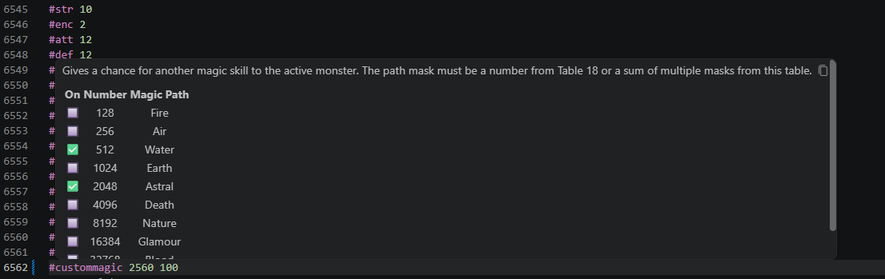

# dominions-mod-support README

This extension provides syntax highlighting, autocomplete and hover information on commands, and an inline editor for bitmask parameters. 

## Features

Full list of known commands and information about it. As well as auto formated snippets when creating/editing objects like monsters or items.

Addtional details including relevent tables for some keywords. Will add more in the future.

Error checking for illegal values and missing #end commands.

If you reference a vanilla asset such as with #selectarmor, if you hover over the value it will give you details of what armor you are selecting. 

Hovering a command which accepts a bitmask parameter displays a table of bitmask values which can be interacted with to modify the bitmask directly.

Commenting and uncommenting hotkey support. 
 

## Known Issues

+ Copy Sprite hover will always show monster details regardless if its in an item's section. 

A lot of commands have no value ranges listed so I have guessed reasonable ranges. If you find errors, please let me know.
Some commands are missing descriptions.

## Release Notes

### 2.0.8

 + Ignore files that don't end with .dm (resolves extension reading from VScode generated .dm.git files)
 + Refactor diagnostic parser to improve performance, maintainability and resolve some false positive errors
 + Improve parser to understand multiline string parameters
 + Add error for when an event command requires a site name to be specified in the #msg
 + Extend validation to cover all modding commands
 + Using a nonexistent command is an error
 + Using a command outside of its intended scope is an error
 + Add an inline bitmask editor (currently supported spec, spec2, startingaff, all terrain bitmasks, custommagic)
 + Add tables for #spec, #spec2 and custommagic bitmasks

### Credits

Thanks to [JTorKag](https://github.com/JTorKag) for creating the original extension

Original credits from JTorkag:

 * I wanted to highlight [djmcgill](https://github.com/djmcgill/vscode-syntax-highlighting-dominions-5-) for creating a syntax highlighting tool years ago. Used that for a while and the decided I wanted to improve on that base. 
 * Thanks [logg-y](https://github.com/Logg-y) for the list of mod manual missing commands. 
 * Thanks [larzm42](https://github.com/larzm42/dom5inspector) for raw game data.
 * General thanks to all the folks in the [Dom Modding Discord](https://discord.gg/4nX6bHPP). Plenty of help when getting clarification of mechanics to provide more accurate information in this extension. 

### ToDO

+ Validate that sprite/sound paths point to a valid file
+ Create special validators for weapon/spell damage commands, which change behaviour based on context
+ Resolve the mod commands to enable previewing and validating the output data
+ Validation for map files

**Enjoy!**
